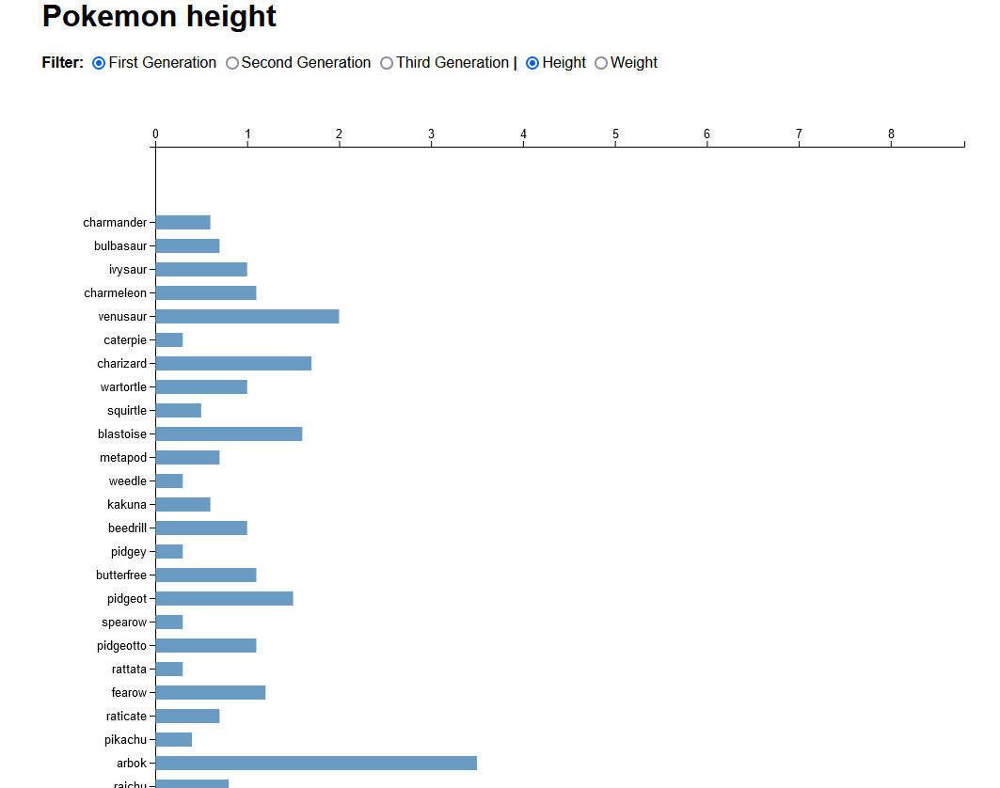

# ⚙ TechTrack-Frontend-Data



## 📂 Assignment

The assignment of Front-end Data is to apply the library [D3.js](https://d3js.org/) to the data that was prepared in [functional programming](https://github.com/KoenHaagsma/TechTrack-Frontend-Applications), we had to use enter(), update() & exit() to apply that data and update it.

## 🧾 Table of contents

-   [About the project](##About-the-project)
-   [Built with](##Built-with)
    -   [Dataset used](###Dataset-used)
-   [Getting started](##Getting-started)
    -   [Installation](##Installation)
-   [Packages/Dependecies](##Packages/dependecies)
    -   [Dependecies](###Dependecies)
    -   [Dev dependecies](###Dev-dependecies)
-   [Wishlist](##Wishlist)
-   [License](##License)

## 📖 About the project

This project consists out of one application, an application to compare the height and weight of Pokemon per generation, for the Pokemon comperator i used an open API called PokeAPI, to get all Pokemons that ever existed in the Pokemon franchise. During the project i logged everyday in a [logbook](https://github.com/KoenHaagsma/TechTrack-Frontend-Data/wiki/%F0%9F%A7%BE-Logboek), if you want to read specific thing that i did from day to day read the [logbook](https://github.com/KoenHaagsma/TechTrack-Frontend-Data/wiki/%F0%9F%A7%BE-Logboek). There is also a wiki with more detailed information.

## 🛠 Built with

The application is built with plain Javascript, Html, i didn't use CSS in this one because the Javascript was a big part of the project.


### 📅 Dataset used

- The dataset from an API, i used the [PokéAPI](https://pokeapi.co/).
  I pasted a small snippet of the JSON file that is being imported:
  ```JSON
  {
  "abilities": [
    {
      "ability": {
        "name": "limber",
        "url": "https://pokeapi.co/api/v2/ability/7/"
      },
      "is_hidden": false,
      "slot": 1
    },
    {
      "ability": {
        "name": "imposter",
        "url": "https://pokeapi.co/api/v2/ability/150/"
      },
      "is_hidden": true,
      "slot": 3
    }
  ],
  ```

## 🔍 Getting started

Before you can start you need to follow the installation

## 🔨 Installation

1. Open the terminal, or use the terminal in your IDE

2. Clone the repository

```
git clone https://github.com/KoenHaagsma/TechTrack-Frontend-Data.git
```

3. Go to the cloned repository

```
cd ../../Techtrack-Frontend-Data
```

4. Start the application for development

```
Use LiveServer (See Dev dependecies) to start a local server.
```

5. You're browser will launch and the application will load, can take a second because of the data that is being fetched.

## 🧰 Packages/dependecies

### 🧱 Dependecies

-   [D3.js](https://d3js.org/)

### 🧱 Dev dependecies

-   [Live server](https://marketplace.visualstudio.com/items?itemName=ritwickdey.LiveServer)

## 🌟 Wishlist

Below i will post what i wanted to add into the project but i didn't do yet.
- Rotate the chart 90 degrees, to fit more with the data;
- Style the data a bit more;
- Add a on hover effect to the bars, i wanted to have the name and the height in there;
- Refactor more code.

## 📑 Sources

-   [D3.js](https://d3js.org/)
-   [Fetch API tutorial](https://www.javascripttutorial.net/javascript-fetch-api/)
-   [DCreating d3 bar chart with objects](https://stackoverflow.com/questions/65676115/create-a-d3-bar-chart-using-a-object)
-   [Barchart](https://codepen.io/sgratzl/pen/NWWKKda)

## 🔖 License

[](https://github.com/KoenHaagsma/TechTrack-Frontend-Data/blob/main/LICENSE)
